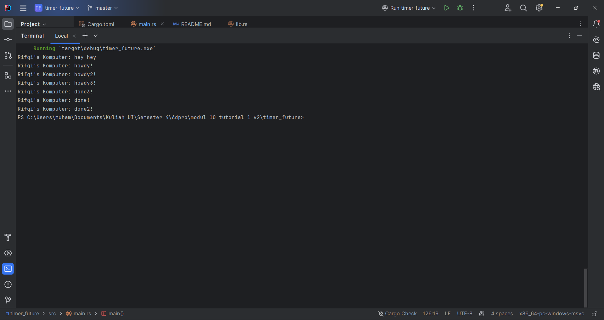
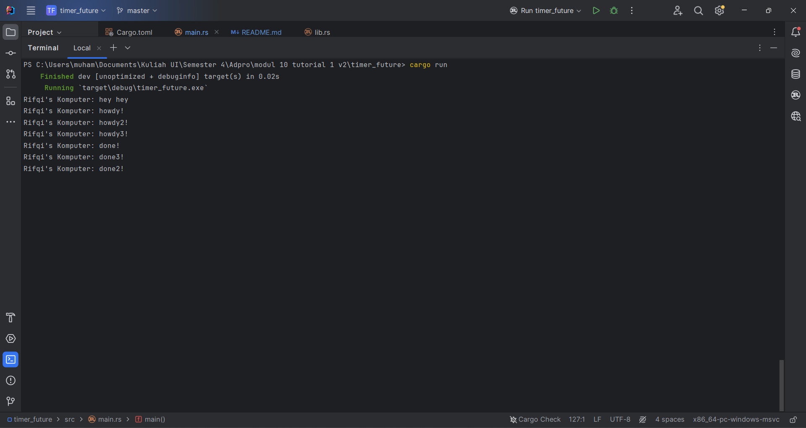

# Understanding how it works.

Line untuk _print_ "Rifqi's Komputer: hey hey" lebih dijanlakan lebih dahulu dibandingkan:
"
Rifqi's Komputer: howdy!
Rifqi's Komputer: done!
"
walaupun howdy! dan done! lebih dahulu _line_-nya. Hal tersebut, karena "howdy! dan done!" berada di dalam _async_, sehingga tidak ditunggu dahulu, tetapi langsung menjalankan _next line_-nya

# _Multiple spawn with drop_

Dengan melakukan pengulangan _print_ "hodwy!" dan "done!" berkali-kali, kita tidak bisa menentukan bagian mana yang akan ter-_print_ terlebih dahulu. Hal tersebut, karena ketiga _task_ tersebut dilakukan secara asinkronus, sehingga kita tidak dapat memastikan _task_ mana yang akan dijalankan terlebih dahulu.

# _Multiple spawn without drop_

Ketika kita menjalankan _multiple spawn_ tetapi dengan menghapus _line of code_ yang men-_drop_ _spawner_, maka kode akan terus berjalan. Executor akan terus menunggu _task_ baru yang mungkin akan diberikan oleh _Spawner_. Sehingga, program tidak akan berhenti jika tidak dihentikan.