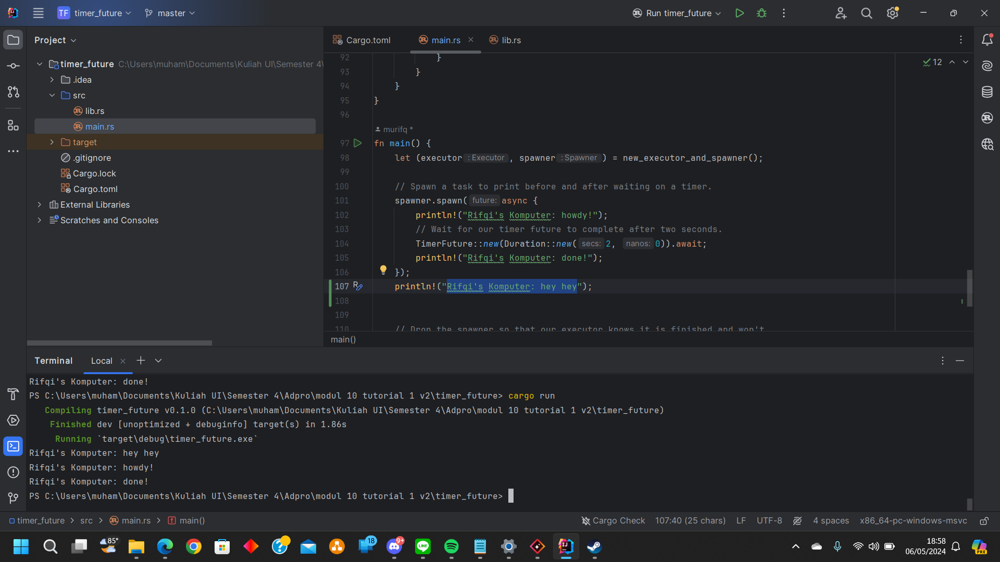

# Understanding how it works.

Line untuk _print_ "Rifqi's Komputer: hey hey" lebih dijanlakan lebih dahulu dibandingkan:
"
Rifqi's Komputer: howdy!
Rifqi's Komputer: done!
"
walaupun howdy! dan done! lebih dahulu _line_-nya. Hal tersebut, karena "howdy! dan done!" berada di dalam _async_, sehingga tidak ditunggu dahulu, tetapi langsung menjalankan _next line_-nya